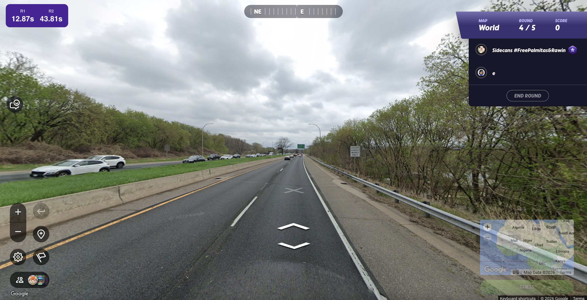

# Bullseye Timer
Bullseye Timer displays a nice lil timer for all your bullseye rounds like this:

## How to Install
1. Make sure you have [tampermoneky](https://www.tampermonkey.net/index.php) installed. 
2. Install the [script](https://github.com/SillyMeowerCat/Bullseye-Timer/raw/refs/heads/main/timer.user.js)
3. Enjoy!

